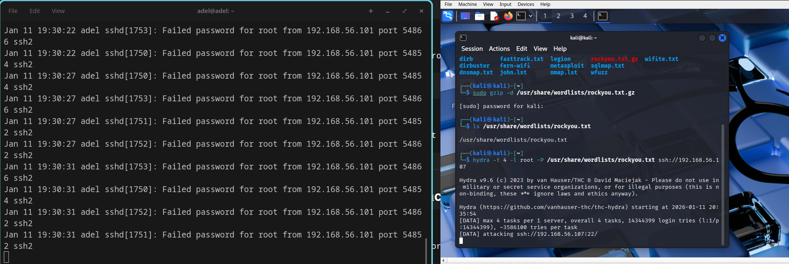
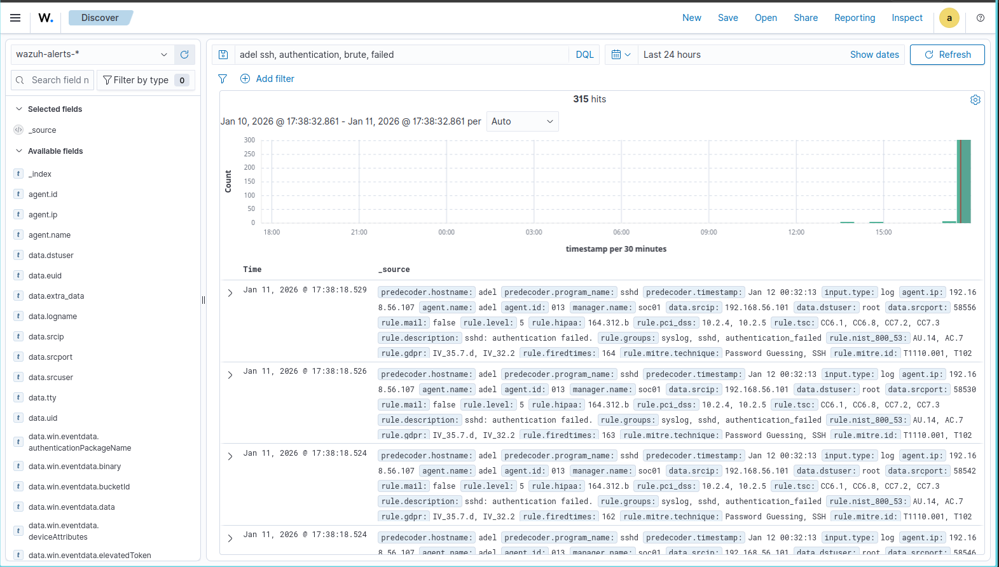

# Project 14: Wazuh SOC – Authentication Attack Detection (Windows + Linux)

## Overview
This project demonstrates a real-world SOC investigation using Wazuh SIEM to detect and analyze authentication attacks on both Windows and Linux endpoints.

## Lab Environment
- Wazuh Manager & Dashboard: SOC01
- Linux Agent: linux01 (Debian 12)
- Windows Agent: windows10 (Windows 10)
- VirtualBox host-only lab network

## Attack Simulation
### Linux
- Repeated SSH login attempts using invalid users
- Example: ssh fakeuser@localhost

### Windows
- Repeated failed sign-in attempts
- Windows Security Event ID 4625 (failed logon)

## Detection
- Wazuh index: wazuh-alerts-*
- Rule group: authentication_failed
- Severity: Medium (rule levels 5–7)
- MITRE ATT&CK: Credential Access – Password Guessing (T1110)

## Investigation
Security events were analyzed in Wazuh using Explore → Discover. Alerts were filtered by agent name and rule group to review rule metadata, decoded fields, and raw log evidence.

## Evidence
Screenshots in this project show:
- Authentication failure alerts in Wazuh Discover
- Expanded Linux SSH failure events
- Expanded Windows 4625 authentication failure events
- Active agent status for linux01 and windows10

## 🔥 Live Attack Simulation: SSH Brute Force (Hydra)

To validate real-world detection capability, a live SSH brute-force attack was executed from a Kali Linux attacker machine using `hydra` against the Debian Linux endpoint.

### Attack Method
- Tool: `hydra`
- Target: SSH service on Linux endpoint
- Technique: Password Guessing (MITRE ATT&CK T1110.001)
- Source IP: Attacker Kali VM
- Target User: root

### Evidence Collected

1. **Live brute-force attack and SSH failure logs**

2. **Wazuh detection and correlation dashboard**

### Result

- Wazuh successfully detected:
  - Repeated SSH authentication failures
  - Brute-force behavior
  - Mapped activity to **MITRE ATT&CK T1110 (Credential Access)**
- Alerts were correlated and visible in the Wazuh dashboard in real time.

This confirms the SOC pipeline is functioning correctly:
Attack → Log → Agent → Manager → SIEM → Alert → Analyst Investigation

## Outcome
The activity was classified as an authentication attack attempt. No successful compromise was detected.
