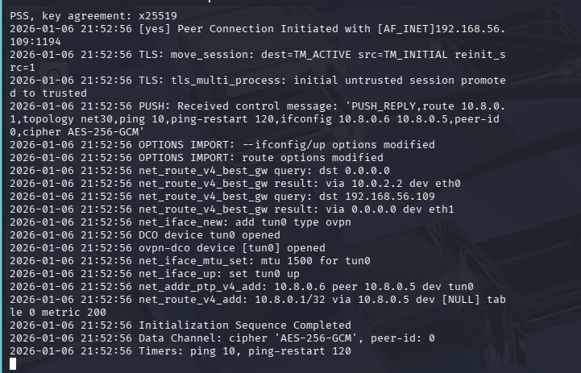
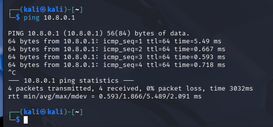
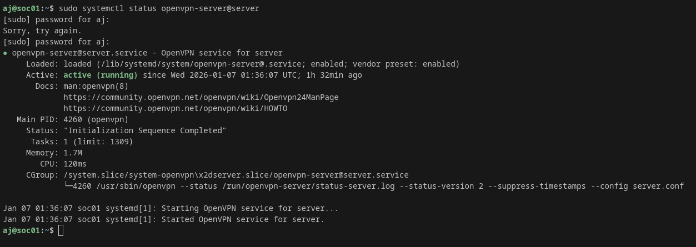

# Project 15: OpenVPN Remote Access Lab

## Objective

Set up a secure OpenVPN server on a Linux server and connect a Kali Linux client using certificates. This simulates real-world secure remote access to an internal network.

---

## Lab Environment

- OpenVPN Server: Ubuntu / Debian (soc01)
- Client: Kali Linux
- Network: VirtualBox Host-Only + NAT
- VPN Network: 10.8.0.0/24

---

## What Was Implemented

- Installed and configured OpenVPN server
- Created PKI and client certificates
- Generated client configuration (.ovpn)
- Connected Kali Linux to VPN
- Verified tunnel interface (tun0)
- Verified connectivity to VPN gateway (10.8.0.1)

---

## Evidence

### 1. OpenVPN Server Running

---

### 2. Kali Connected (tun0 interface)

---

### 3. Kali Can Ping VPN Gateway

---

### 4. OpenVPN Connection Log

---

## Skills Demonstrated

- VPN deployment
- Linux networking
- Secure remote access
- PKI & certificates
- Tunnel interfaces (tun)
- Real-world SOC / Admin infrastructure skills

---

## Why This Matters

VPNs are critical in:
- SOC environments
- Remote administration
- Secure internal network access
- Enterprise infrastructure

This lab demonstrates real-world secure access setup used in production environments.
