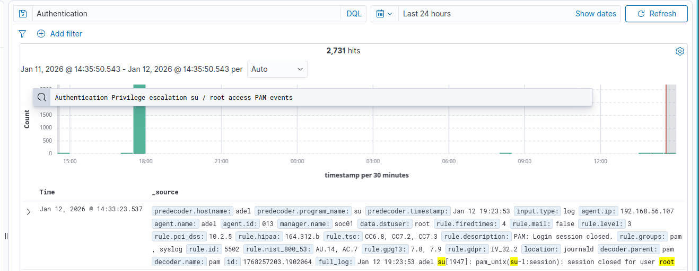
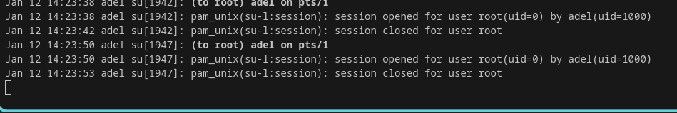

# Project 17: SOC Alert Triage & Case Management (Wazuh SIEM)

## Objective

Demonstrate a SOC analyst workflow by triaging, investigating, classifying, and documenting multiple security alerts using Wazuh SIEM.

---

## Lab Environment

- SIEM: Wazuh
- Endpoints: Debian Linux, Windows 10
- Attacker: Kali Linux
- Alert Sources:
  - SSH authentication failures
  - Privilege escalation (sudo)
  - Windows failed logons

---

## Alerts Investigated

| Alert | Source | Classification |
|------|--------|---------------|
| SSH Brute Force | Linux | True Positive (Malicious) |
| Sudo Abuse | Linux | True Positive (Suspicious Activity) |
| Windows Failed Logons | Windows | Benign / Investigated |

---

## SOC Workflow Used

1. Alert ingestion
2. Triage & prioritization
3. Log analysis
4. Severity assignment
5. Classification:
   - False Positive
   - Benign True Positive
   - Malicious True Positive
6. Case documentation
7. Closure or escalation decision

---

## Case 1: SSH Brute Force Attack
- MITRE ATT&CK: T1110 – Brute Force
- Source IP: Kali Linux
- Evidence: auth.log, Wazuh alerts
- Classification: **True Positive – Malicious**
- Severity: High
- Action: Recommend IP block, fail2ban, SSH hardening

---

## Case 2: Suspicious Sudo Usage

- User executed privileged commands
- Evidence: /var/log/auth.log
- Classification: **True Positive – Suspicious**
- Severity: Medium
- Action: Review user activity, verify legitimacy

---

## Case 3: Windows Failed Logons

- Multiple failed attempts
- Evidence: Event ID 4625
- Classification: **Benign / User Error**
- Severity: Low
- Action: No escalation

(Screenshot here)

---

## Skills Demonstrated

- SOC alert triage
- SIEM investigation
- Log analysis (Linux & Windows)
- Incident classification
- Case management
- Severity assessment
- MITRE ATT&CK mapping
- Documentation

---

## Conclusion

This project demonstrates real-world SOC operations including alert triage, investigation, classification, and response decision-making using Wazuh SIEM.
