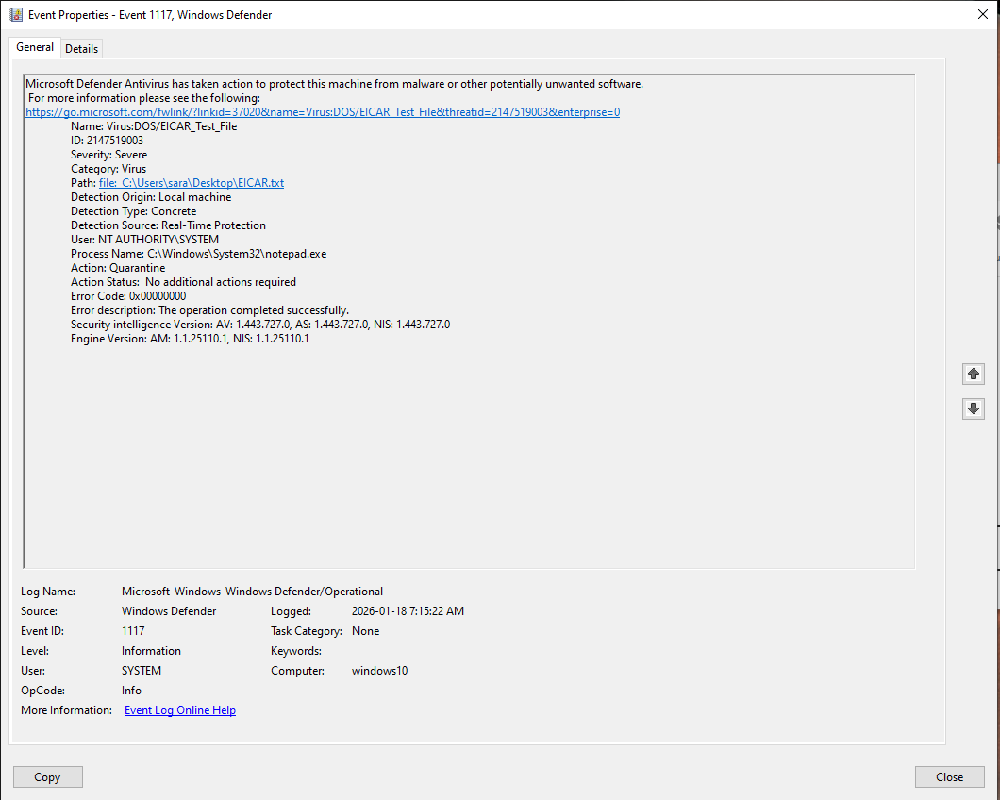
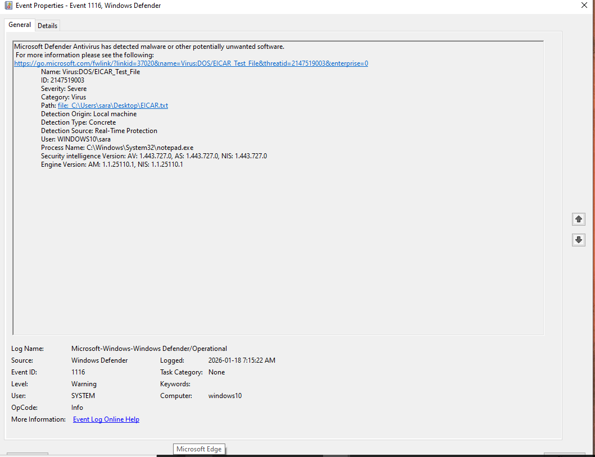
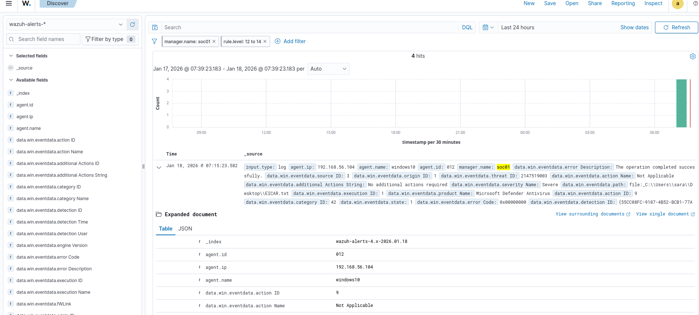
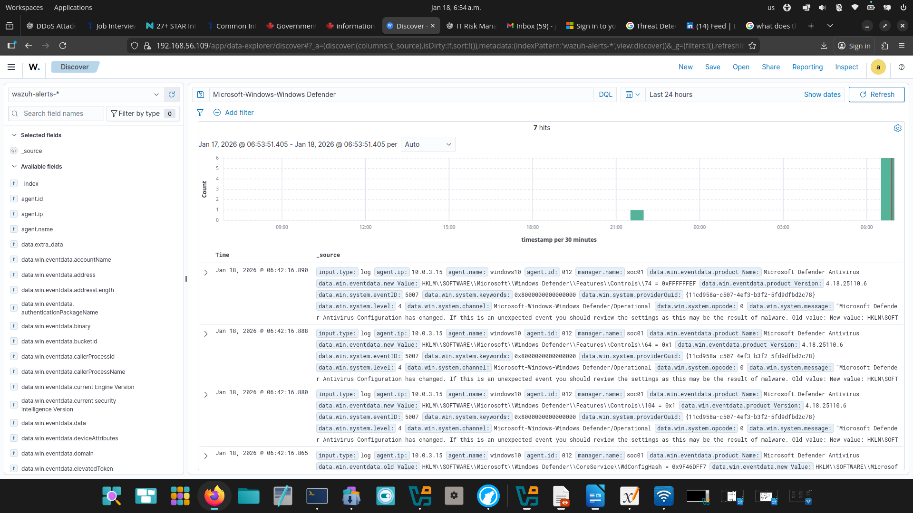
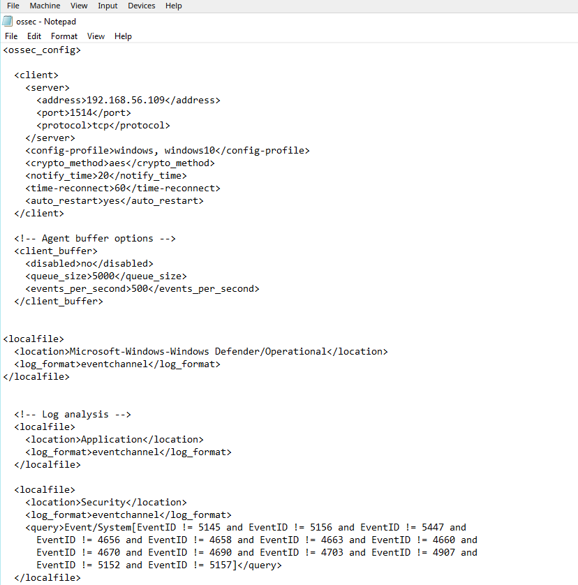
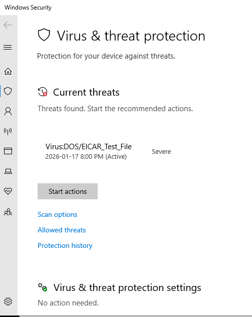

# Project 18: Windows Malware Detection using Defender & Wazuh

## Objective

Demonstrate how a SOC analyst detects, investigates, and validates a malware alert on a Windows system using Microsoft Defender and Wazuh SIEM.

---

## Lab Environment

- SIEM: Wazuh
- Endpoint: Windows 10
- Detection Engine: Microsoft Defender
- Attack Type: EICAR test malware file
- Log Source: Windows Defender Operational Event Log

---

## Incident Summary

A test malware file (EICAR) was created on the Windows system to simulate a real malware detection.  
Microsoft Defender detected and blocked the file, and the event was forwarded to Wazuh SIEM for investigation.

This confirms that:

- Endpoint protection is working
- Logs are being collected
- Wazuh is correctly ingesting and displaying security events

---

## Evidence

### 1. Defender Malware Detection (Event ID 1116)

---

### 2. Defender Remediation Action (Event ID 1117)

---

### 3. Wazuh Discover Showing Malware Event

---

### 4. Wazuh Defender Operational Log Ingestion

---

### 5. Wazuh Agent Configuration (Defender Log Source)

---

### 6. Windows Security Dashboard

---

## Investigation Steps

1. Created EICAR test malware file on Windows
2. Microsoft Defender immediately detected and blocked it
3. Verified detection in Windows Event Viewer
4. Confirmed Wazuh agent is collecting Defender logs
5. Found the malware alert inside Wazuh Discover
6. Verified alert details and classification

---

## Classification

- Type: Malware Detection
- Severity: High
- Status: True Positive
- Impact: No compromise (blocked successfully)

---

## Recommendations

- Ensure Defender remains enabled
- Keep Wazuh agent monitoring Defender logs
- Monitor for repeated detections
- Investigate if detections occur on production systems

---

## Skills Demonstrated

- SOC alert triage
- Malware investigation
- Windows event log analysis
- Wazuh SIEM investigation
- Endpoint security monitoring
- Incident documentation

---

## Conclusion

This project demonstrates a real-world SOC workflow for malware detection, validation, and investigation using Microsoft Defender and Wazuh SIEM.
