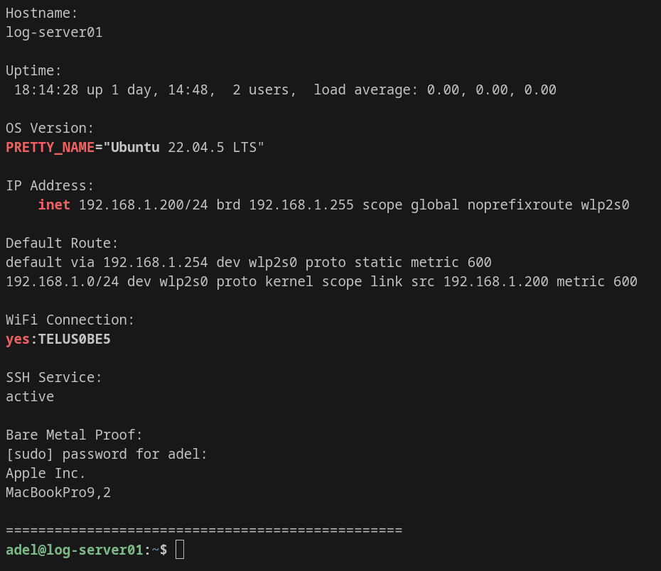

# Project 24 – Bare Metal Ubuntu Log Server Setup (WiFi + Static IP + SSH Headless + Tailscale Remote Access)



---

## 📌 Project Overview

This project documents how I converted an old laptop into a **real bare-metal Ubuntu Server** (NOT a VM) and configured it as a **headless SOC log server**.

The server runs on **WiFi**, uses a **static IP address**, and is managed remotely via **SSH** from my Pop!_OS workstation and MacBook Pro.

To enable secure remote access from anywhere in the world (outside my home network), I deployed **Tailscale VPN**, allowing encrypted access without exposing SSH (port 22) to the public internet.

This project is the foundation for my SOC infrastructure and future centralized logging projects.

---

## ⭐ Why This Project Matters (Real-World Value)

Most students build servers only inside VirtualBox or VMware.

In this project, I built a **real server on physical hardware**, configured WiFi networking manually, solved connectivity issues, enabled secure remote access, and verified stable operation.

Key achievements:

- ✅ Installed Ubuntu Server on bare metal hardware
- ✅ Configured WiFi on Ubuntu Server (headless)
- ✅ Assigned static IP address using Netplan
- ✅ Verified routing and DNS resolution
- ✅ Enabled SSH remote administration
- ✅ Verified SSH port listening and remote login
- ✅ Deployed Tailscale VPN for secure global access
- ✅ Verified remote SSH access over Tailscale from MacBook Pro

---

## 🧠 Skills Demonstrated

- Linux server installation (bare metal)
- WiFi troubleshooting on Ubuntu Server
- Static IP configuration using Netplan
- DNS and routing verification
- SSH headless remote administration
- systemd service management
- VPN-based secure remote access (Tailscale)
- SOC infrastructure design foundations
- Professional GitHub documentation with proof screenshots

---

## 🖥️ Lab Environment (Bare Metal Hardware)

### Server Machine (Bare Metal)

| Component | Value |
|----------|-------|
| Device Type | Laptop (Bare Metal Server) |
| OS | Ubuntu Server 22.04.5 LTS |
| Hostname | log-server01 |
| Network | WiFi |
| LAN Static IP | 192.168.1.200 |
| Tailscale VPN IP | 100.100.30.98 |
| Role | SOC Log Server / Central Logging Node |

### Client Machines (Administration Workstations)

| Device | Role |
|--------|------|
| Pop!_OS Workstation | SSH Client / Lab Workstation |
| MacBook Pro 2020 | SSH Client / Remote Administration |
| iPhone 13 | Tailscale VPN Client |

---

## 🌐 Network Architecture

### Home SOC Lab Layout (Local Network)

```text
[MacBook Pro 2020]  ---> SSH --->  [log-server01 (Ubuntu Server)]
[Pop!_OS Workstation] ---> SSH ---> [log-server01 (Ubuntu Server)]

                (WiFi Router / Access Point)
