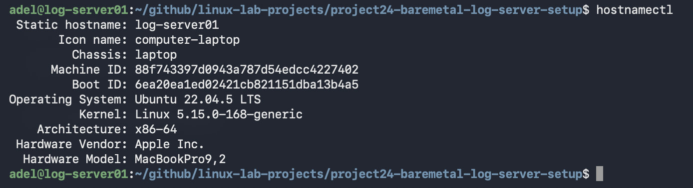
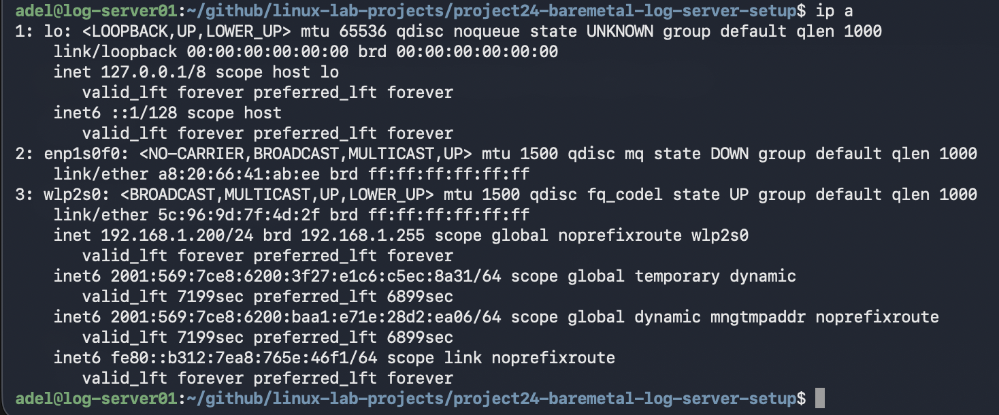
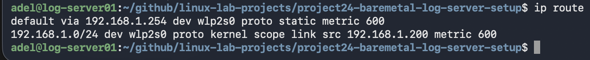
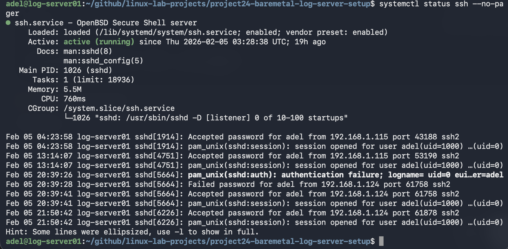
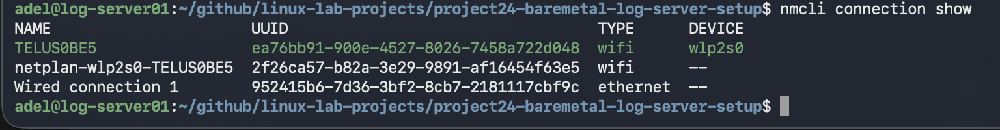
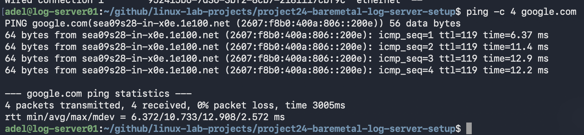
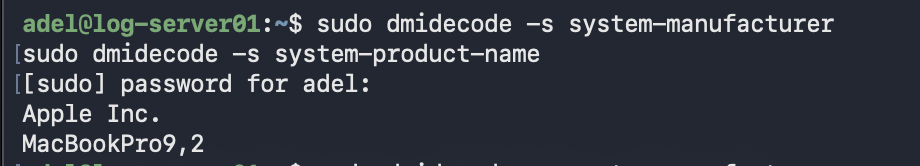

# Project 24 – Bare Metal Ubuntu Log Server Setup (WiFi + Static IP + SSH Headless)

## 📌 Project Overview
This project documents how I converted an old laptop into a **real bare-metal Ubuntu Server** (NOT a VM) and configured it as a **headless SOC log server**.

The server runs on **WiFi** with a **static IP address** and is managed remotely via **SSH** from my MacBook and Linux workstation.

This project serves as the foundation for future SOC infrastructure such as:

- Centralized Linux log collection
- rsyslog forwarding
- Wazuh / Splunk / Graylog log ingestion
- Threat detection labs
- Incident response & forensic investigation environments

---

## ⭐ Why This Project Matters (What Makes It Strong)
Most students build servers only inside VirtualBox or VMware.
---

## 🧠 Skills Demonstrated

- Linux Server installation on bare metal hardware
- WiFi troubleshooting on Ubuntu Server
- Static IP configuration using Netplan
- DNS and routing verification
- SSH headless remote administration
- Systemd service management
- SOC lab infrastructure preparation
- Professional GitHub documentation with screenshots evidence

---

## 🗺️ Network Diagram (High-Level)

```text
[MacBook Pro 2020]  ---> SSH --->  [log-server01.local (Ubuntu Server)]
[Linux Workstation] ---> SSH --->  [log-server01.local (Ubuntu Server)]

                     (WiFi Router / Access Point)


In this project, I built a **real server on physical hardware**, configured networking manually, solved connectivity issues, and successfully deployed a stable headless setup.

Key achievements:

✅ Installed Ubuntu Server on bare metal laptop  
✅ Configured WiFi networking on Ubuntu Server  
✅ Assigned static IP address using Netplan  
✅ Verified routing + DNS resolution  
✅ Enabled SSH for remote headless access  
✅ Verified auto-connect and system uptime  
✅ Confirmed the system is NOT running inside a VM  

---

## 🖥️ Lab Environment (Bare Metal Hardware)

### Server Machine (Bare Metal)

| Component | Value |
|----------|-------|
| Device Type | Laptop (Bare Metal Server) |
| OS | Ubuntu Server 22.04 LTS |
| Hostname | log-server01 |
| Network | WiFi |
| Role | SOC Log Server / Central Logging Node |

### Client Machines (Administration Workstations)

| Device | Role |
|--------|------|
| MacBook Pro 2020 | SSH Client / Documentation |
| Linux Workstation | SSH Client / SOC Lab Workstation |

---

## 🌐 Network Architecture
The server is connected to WiFi and assigned a static IP address.

It can be accessed remotely via SSH:

```bash
ssh adel@log-server01.local

---

## ✅ Screenshots Evidence (Proof)
These screenshots prove the server is working, reachable, and running on real hardware.

| Step | Screenshot |
|------|------------|
| Hostname Check |  |
| OS Version Proof |  |
| Static IP Applied |  |
| Default Gateway Route |  |
| SSH Service Running |  |
| WiFi Connection Verified |  |
| Internet Access Verified |  |
| Bare Metal Proof (DMI Decode) |  |

---

## 🧠 Troubleshooting & Lessons Learned

### Issue 1: Static IP not applying after reboot
**Problem:** After reboot, the server sometimes came back with a DHCP IP.  
**Cause:** Netplan + cloud-init can manage `/etc/netplan/50-cloud-init.yaml`.  
**Fix:**
```bash
sudo netplan apply

