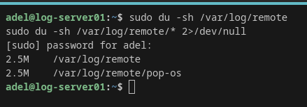
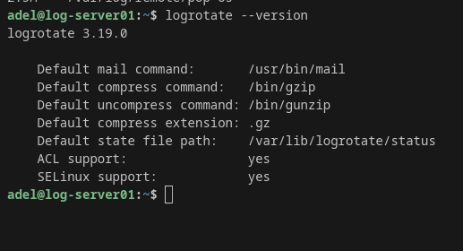
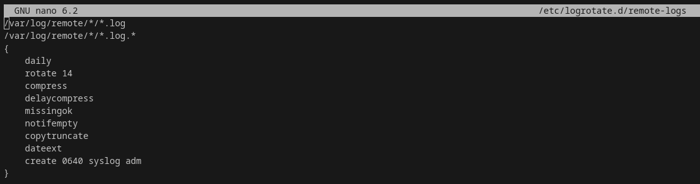
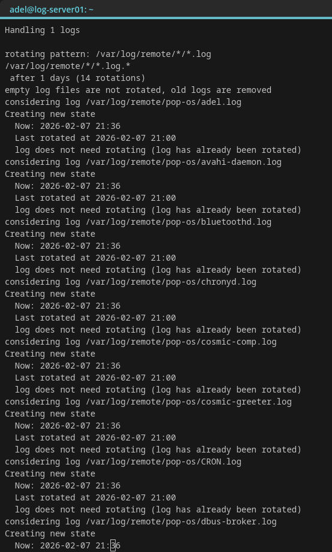
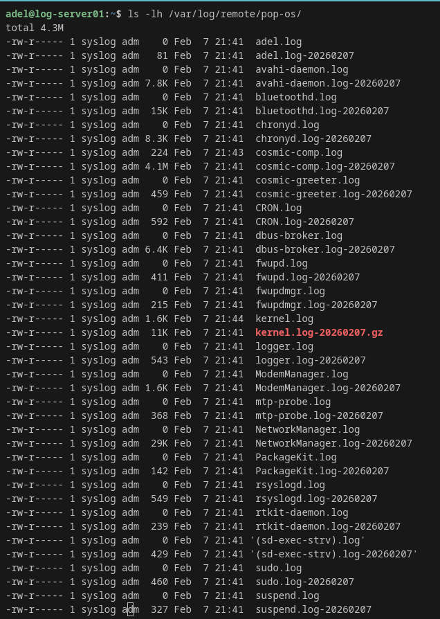
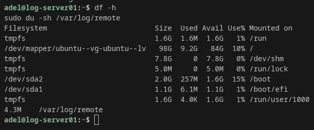

# Project 26 – Log Rotation & Storage Management (Log Server Hardening)

Goal: Prevent disk exhaustion by rotating and compressing centralized logs stored under `/var/log/remote/`.

## Lab
- Log Server: log-server01 (Ubuntu Server) – 192.168.1.200
- Client: Pop!_OS workstation – 192.168.1.115

## Proof Screenshots
1. Remote log folder size before rotation
2. logrotate version
3. logrotate config file
4. Dry-run test output
5. Force-run output
6. Rotated/compressed logs proof
7. Disk usage after

## Proof Screenshots

| Step | Screenshot |
|------|------------|
| Remote log folder size before rotation |  |
| Logrotate version |  |
| Logrotate config file |  |
| Dry run test |  |
| Force run execution |  |
| Rotated/compressed logs proof |  |
| Disk usage after |  |
