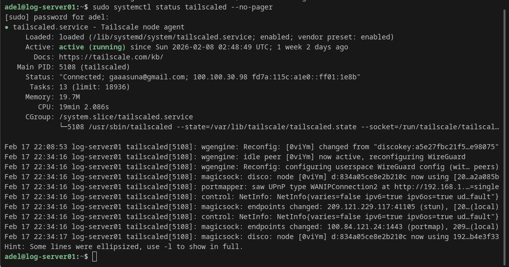
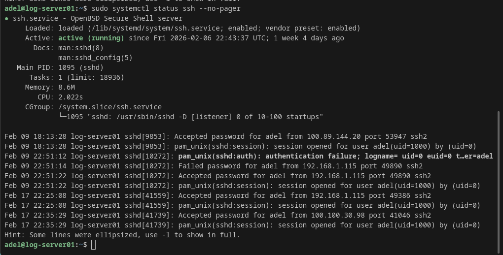
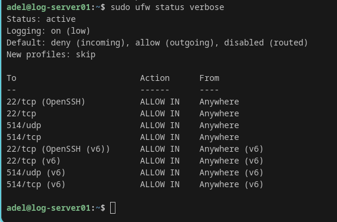
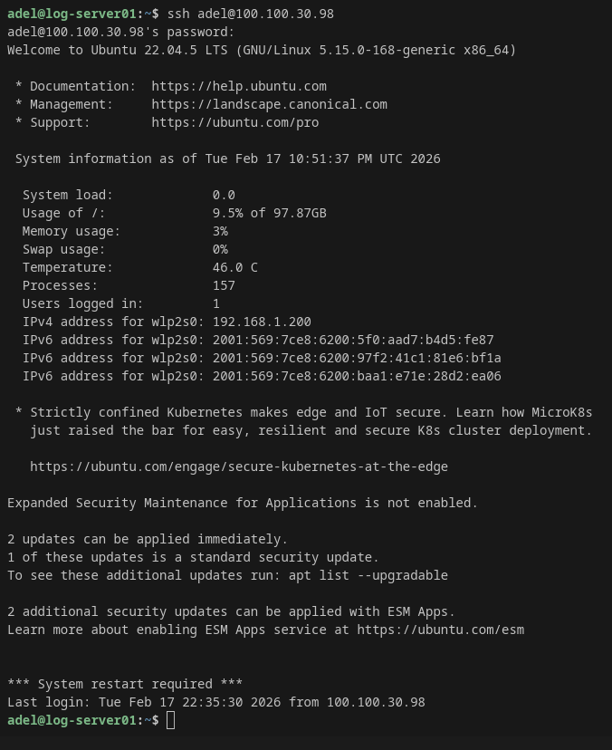
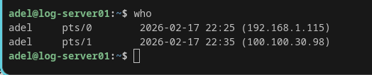

# Project 27 – Secure Remote SSH Access from Anywhere (Tailscale VPN)

---

## 📌 Project Overview

This project documents how I configured secure remote access to my Ubuntu server using **Tailscale VPN**.

Instead of exposing SSH (port 22) to the public internet through port forwarding, I used **Tailscale**, which creates an encrypted private network between my devices using WireGuard.

This allows me to securely SSH into my server from anywhere in the world (Canada, India, public WiFi, mobile data) without changing router settings.

---

## ⭐ Why This Project Matters (Real-World Value)

Many home labs expose SSH to the internet using port forwarding, which increases risk of brute-force attacks.

In real enterprise environments, remote access is usually done through secure VPN solutions.

This project demonstrates real-world security best practice by using:

- VPN-based access
- Private internal IP addressing (100.x.x.x)
- Encrypted device-to-device communication

---

## 🧠 Skills Demonstrated

- Secure remote administration (SSH)
- VPN remote access using Tailscale
- WireGuard encrypted networking concepts
- Device authorization and management
- SOC-style infrastructure access setup
- Linux troubleshooting and verification commands

---

## 🖥️ Lab Environment

| Device | OS | Role |
|--------|----|------|
| log-server01 | Ubuntu Server 22.04 LTS | Remote SSH target |
| Pop!_OS Workstation | Pop!_OS Linux | Admin workstation |
| MacBook Pro 2020 | macOS | Remote admin client |
| iPhone 13 | iOS | Mobile VPN access |

---

## 🌍 Network Architecture (Remote Access Design)

### Local Network (Home Lab)

```text
[Pop!_OS] ---> SSH ---> [log-server01]
[MacBook] ---> SSH ---> [log-server01]

        (Home WiFi Router)
### Tailscale Network (Secure Remote Access)

```text
[Pop!_OS] ---\
[MacBook] -----> (Tailscale VPN 100.x.x.x) -----> [log-server01]
[iPhone] ---/


---

## 📸 Screenshots Evidence

### ✅ Server (log-server01) - Tailscale + SSH Verification

#### Tailscale status


#### Tailscale daemon running


#### SSH service running


#### UFW firewall rules


---

### ✅ Client (Pop!_OS) - Remote SSH Connection Proof

#### SSH login from Pop!_OS using Tailscale IP


---

### ✅ Proof of Multiple Sessions

#### Showing SSH sessions (local + Tailscale)

