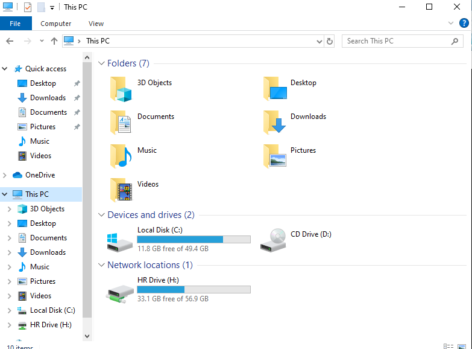
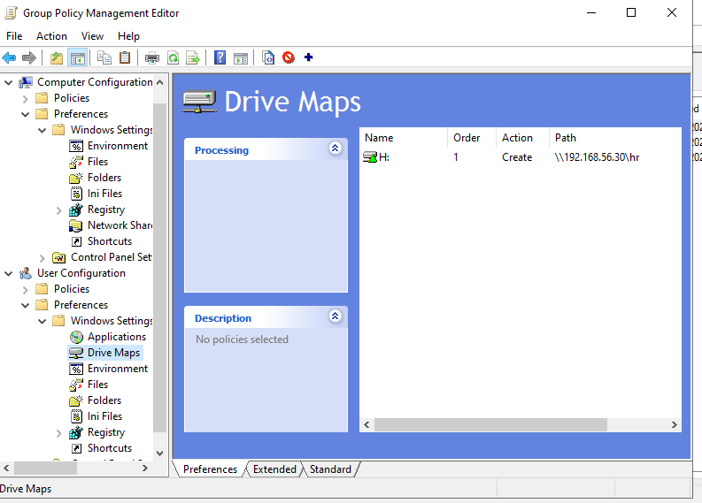
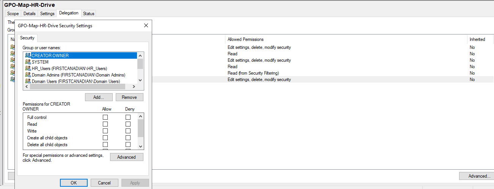
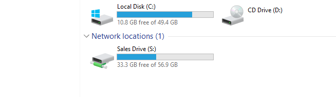
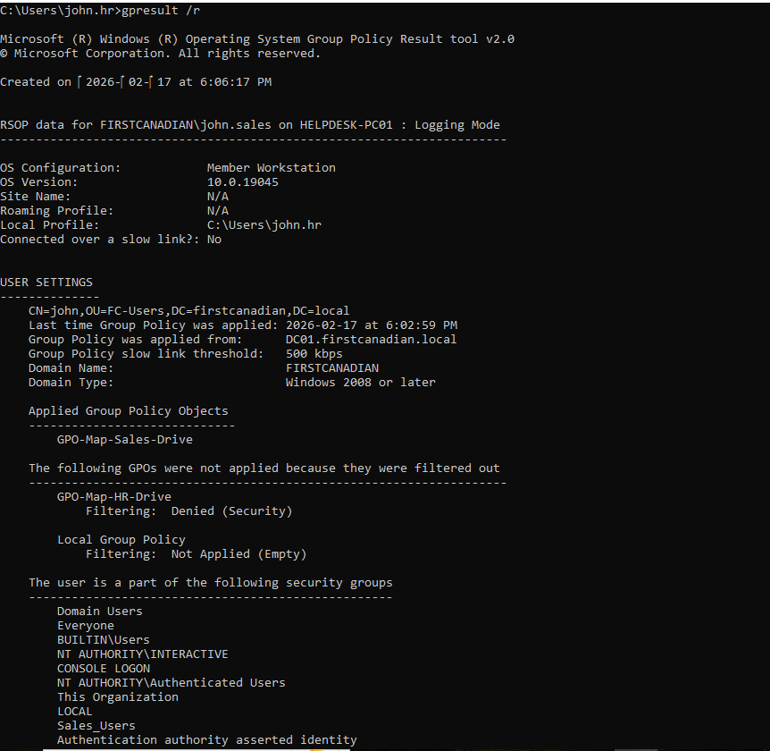
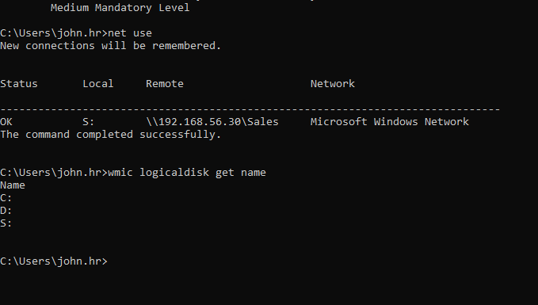
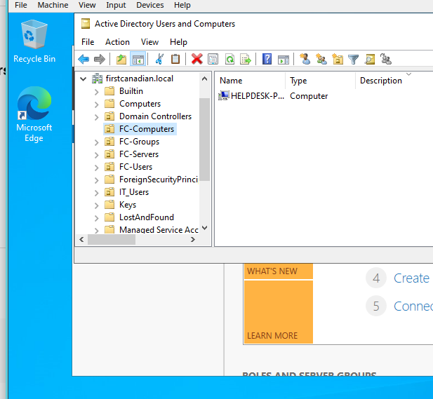

# Project 28: Helpdesk Active Directory Lab – Users, Groups, Shared Drives & GPO Drive Mapping Automation

## 📌 Overview
This project demonstrates a realistic **Helpdesk / Desktop Support Active Directory environment** where users and departments are managed using **Active Directory Domain Services (AD DS)**, and department shared drives are mapped automatically using **Group Policy Preferences (GPO Drive Maps)**.

The goal of this lab is to simulate what an IT Support / Helpdesk Technician would do in a real company:

✅ Create users and groups  
✅ Organize departments using OUs  
✅ Create shared folders on a file server  
✅ Apply correct access control  
✅ Automate drive mapping using Group Policy  
✅ Troubleshoot why a GPO fails and fix it  
✅ Validate results using Windows tools (`gpupdate`, `gpresult`, `net use`)

This is a hands-on lab designed to be **recruiter-friendly** and show real job-ready skills.

---

## 🎯 Key Skills Demonstrated
- Active Directory Users and Computers (ADUC)
- Organizational Units (OU) Design
- Security Groups (HR_Users, Sales_Users)
- Windows File Sharing (SMB Shares)
- NTFS Permissions & Share Permissions
- Group Policy Management (GPMC)
- Group Policy Preferences (Drive Maps)
- Security Filtering
- Item-Level Targeting
- Troubleshooting GPO issues
- Windows command-line verification

---

## 🏗️ Lab Environment

| Machine | Hostname | OS | Role | IP Address |
|--------|----------|----|------|-----------|
| Domain Controller | DC01 | Windows Server 2022 | AD DS + DNS + GPMC | 192.168.56.10 |
| File Server | FILE01 | Ubuntu Server | Samba File Server (SMB Shares) | 192.168.56.30 |
| Workstation | HELPDESK-PC01 | Windows 10 Pro | Domain Client PC | 192.168.56.20 |

Domain Name: **firstcanadian.local**

---

## 🧱 Active Directory Structure

### Organizational Units (OUs)
The following OUs were created to organize the domain properly:

- **FC-Users**
- **FC-Groups**
- **FC-Computers**
- **FC-Servers**

---

## 👥 Users & Groups Created

### Security Groups
- **HR_Users**
- **Sales_Users**

### User Accounts
| Username | Department | Group |
|---------|------------|------|
| maria.hr | HR | HR_Users |
| john.sales | Sales | Sales_Users |

---

## 📁 File Shares Created (Ubuntu Samba Server)

Department folders were created and shared using Samba:

| Department | Share Name | Path | Drive Letter |
|-----------|------------|------|-------------|
| HR | hr | /srv/shares/hr | H: |
| Sales | Sales | /srv/shares/sales | S: |
| Warehouse | Warehouse | /srv/shares/warehouse | W: |
| IT | IT | /srv/shares/it | I: |

---

## 🌐 Network Share Paths Used

| Department | Share Path |
|-----------|------------|
| HR | `\\192.168.56.30\hr` |
| Sales | `\\192.168.56.30\Sales` |

---

## 🛠️ Group Policy Objects (GPOs)

Two GPOs were created to automatically map drives:

| GPO Name | Drive Letter | Path | Applies To |
|---------|--------------|------|-----------|
| GPO-Map-HR-Drive | H: | `\\192.168.56.30\hr` | HR_Users |
| GPO-Map-Sales-Drive | S: | `\\192.168.56.30\Sales` | Sales_Users |

Drive mapping was configured under:

`User Configuration > Preferences > Windows Settings > Drive Maps`

---

## 🔐 Security Filtering (Core Concept)

Security Filtering ensures:
- HR users receive HR drive mapping only
- Sales users receive Sales drive mapping only

This prevents users from seeing drives outside their department.

---

## ⚙️ Sales Drive Mapping Configuration (Item-Level Targeting)

Sales drive mapping was configured with:

- Action: **Create**
- Drive Letter: **S:**
- Path: `\\192.168.56.30\Sales`
- Label: **Sales Drive**
- Item-level targeting: **Sales_Users**

---

## ✅ Testing & Verification Commands (Windows Client)

These commands were used on Windows 10 to verify correct policy application:

```cmd
gpupdate /force
gpresult /r
net use
wmic logicaldisk get name
echo %logonserver%
```
---

## 🖼️ Evidence (Screenshots)

### HR Drive Mapping (Maria)


### HR GPO Drive Map Configuration


### GPO Permissions Fix (Authenticated Users Read)


### Sales Drive Mapping (John)


### Sales GPO Applied (gpresult)


### Sales Drive Verified (net use + wmic)


### OU Placement

