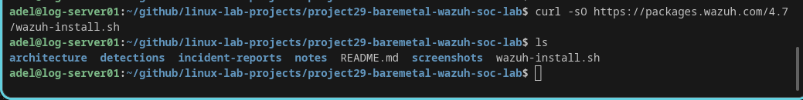
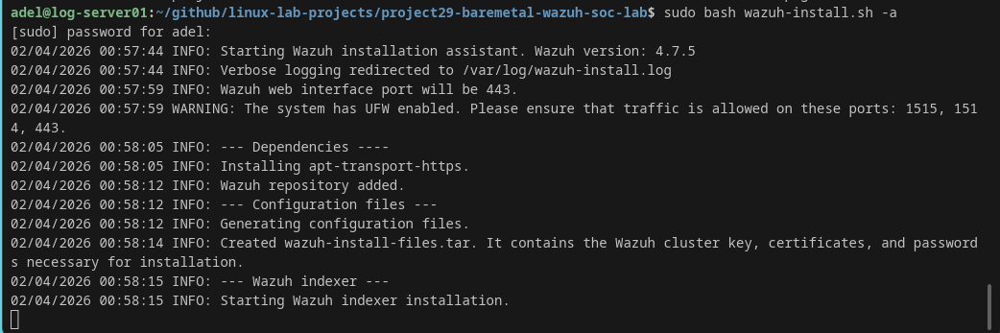
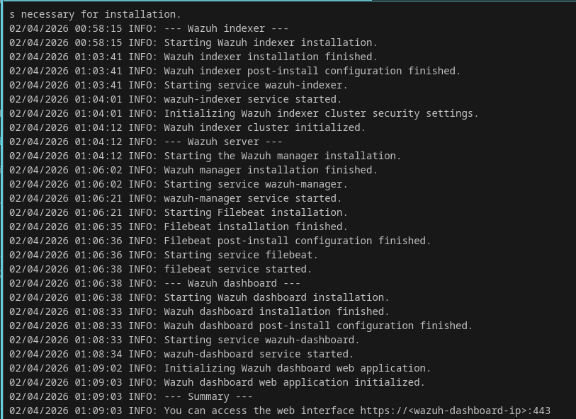
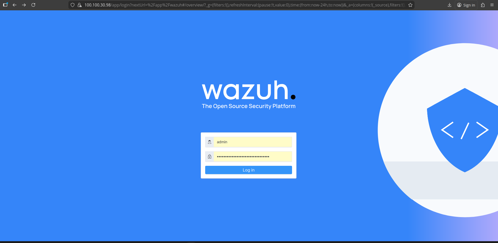
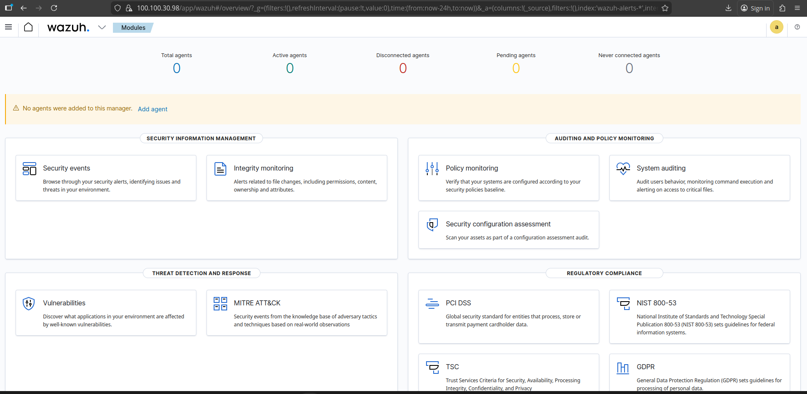
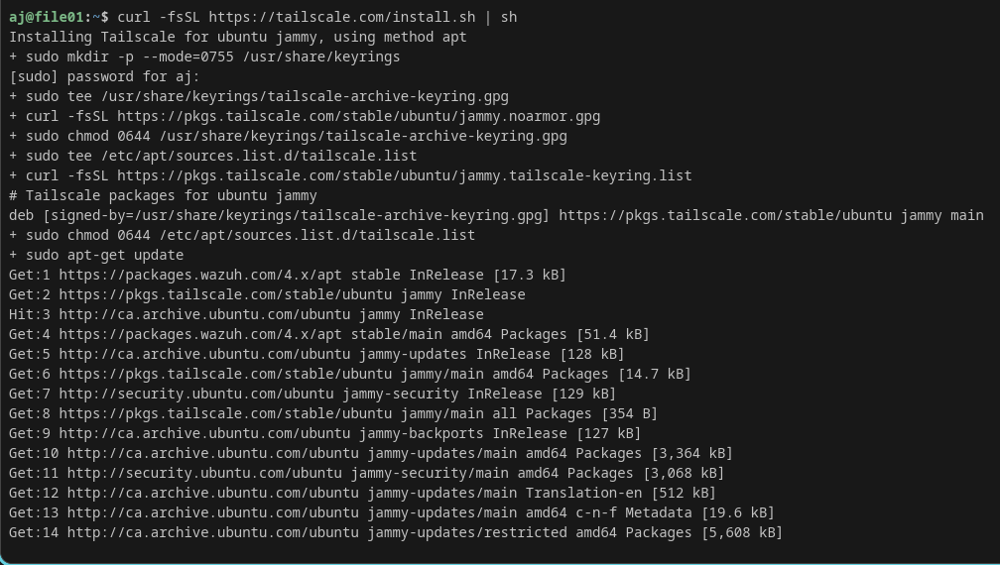
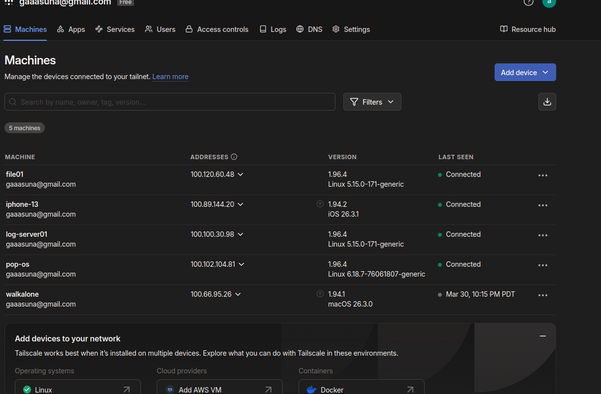
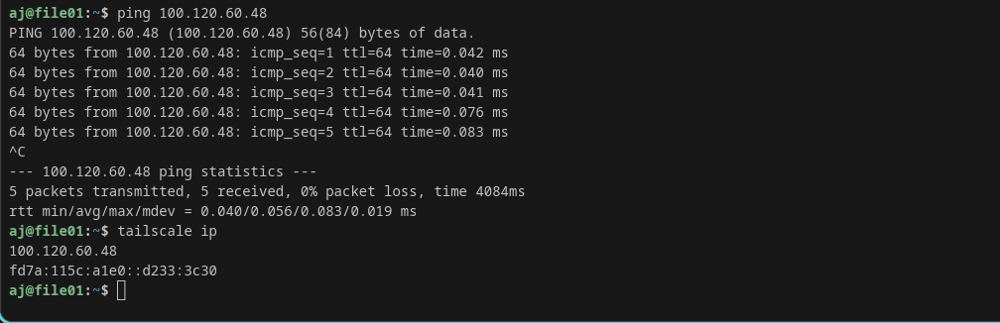

# 🛡️ Wazuh SIEM Lab – Windows & Linux Attack Detection

---

## 📌 Overview

This project demonstrates a SOC-style SIEM lab built using Wazuh on a bare-metal Ubuntu server.

The lab monitors both Linux and Windows endpoints and detects security events in real time.

### ✅ What this lab simulates:

- SIEM deployment (Wazuh)
- Windows & Linux log monitoring
- Secure connectivity using Tailscale VPN
- Attack detection (failed login / brute force)
- Real SOC investigation workflow

---

## 🏗️ Lab Environment

| Machine | Hostname | OS | Role |
|--------|----------|----|------|
| SIEM Server | log-server01 | Ubuntu Server | Wazuh Manager |
| Linux Endpoint | file01 | Ubuntu | Wazuh Agent |
| Windows Endpoint | HELPDESK-PC01 | Windows 10 | Wazuh Agent |

---

## 🔧 Technologies Used

- Wazuh SIEM (Manager + Dashboard + Agents)
- Ubuntu Server 22.04
- Windows 10 Pro
- Tailscale VPN
- Bash / PowerShell
- Windows Event Logs

---

## ⚙️ Installation & Setup

### Download Wazuh



---

### Start Installation



---

### Installation Progress



---

### Wazuh Login



---

### Wazuh Dashboard



---

## 🌐 Secure Connectivity (Tailscale)

### Install Tailscale



---

### Devices Connected



---

### Connectivity Test



---

## 🎯 Attack Simulation

### Scenario: Failed Login Attack (Brute Force)

A brute-force login attempt was simulated on Windows using:

```powershell
runas /user:administrator cmd
