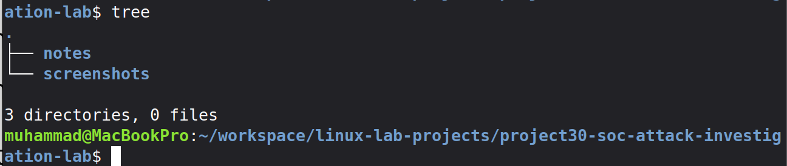

# Project 30: SOC Attack Investigation Lab

## Overview
This project demonstrates a full SOC (Security Operations Center) workflow by simulating real-world attacks and analyzing them using Wazuh SIEM.

## Lab Environment
- Kali Linux (Attacker)
- file01 Linux Server (Monitored Endpoint)
- Wazuh Server (SIEM)
- Linux Mint MacBook (SOC Workstation)
- Tailscale Private Network

## Objectives
- Simulate brute-force attacks
- Detect failed and successful logins
- Investigate attacker behavior
- Analyze alerts in Wazuh dashboard
- Understand lateral movement and privilege escalation

## Project Structure
- README.md → Project explanation
- notes/ → Investigation notes
- screenshots/ → Evidence and proof

## Setup Evidence

### Project Folder Structure

