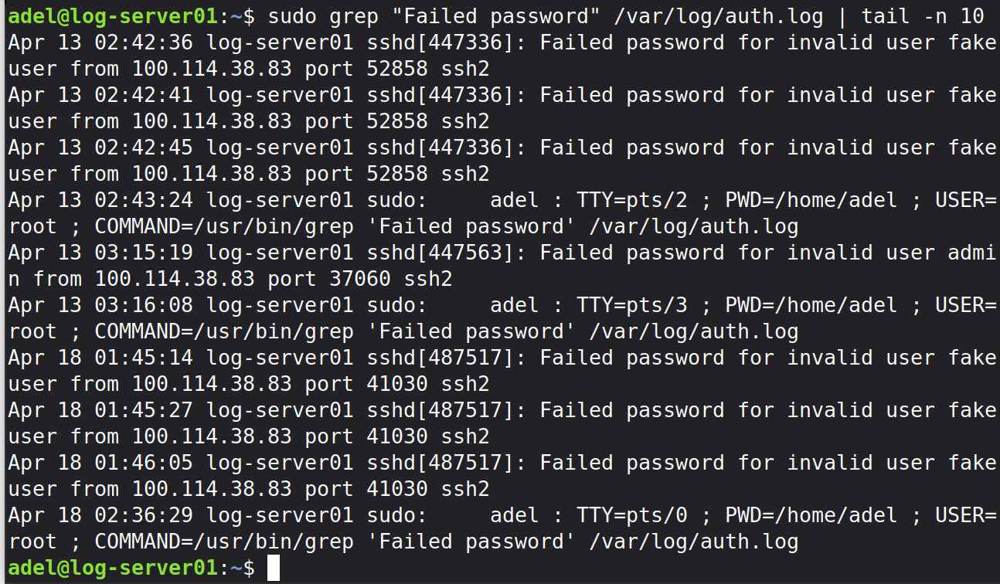
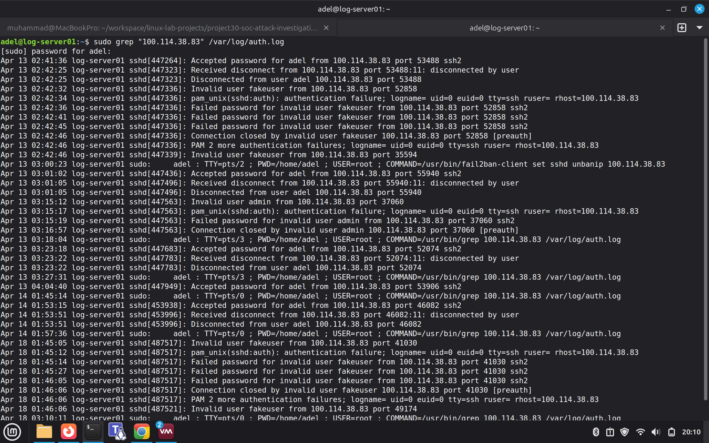

# Project 30: SOC Attack Investigation Lab

## Overview
This project demonstrates a full SOC (Security Operations Center) workflow by simulating real-world attacks and analyzing them using Wazuh SIEM.

## Lab Environment
- Kali Linux (Attacker)
- file01 Linux Server (Monitored Endpoint)
- Wazuh Server (SIEM)
- Linux Mint MacBook (SOC Workstation)
- Tailscale Private Network

## Objectives
- Simulate brute-force attacks
- Detect failed and successful logins
- Investigate attacker behavior
- Analyze alerts in Wazuh dashboard
- Understand lateral movement and privilege escalation

## Project Structure
- README.md → Project explanation
- notes/ → Investigation notes
- screenshots/ → Evidence and proof

## Setup Evidence

### Project Folder Structure

## Scenario 1: SSH Brute-Force Attempt Against Wazuh Server

### Goal
Simulate repeated failed SSH login attempts from Kali Linux against the Wazuh server and investigate the activity from the SOC workstation.

### Attacker
- Kali Linux
- Tailscale IP: `100.114.38.83`

### Target
- Wazuh server
- Tailscale IP: `100.100.30.98`

### Expected Detection
- Failed password attempts in `/var/log/auth.log`
- Repeated attempts from the same source IP
- Fail2Ban blocking the attacker after multiple failures
- Wazuh security events showing the activity
### Log Analysis (auth.log)

The failed login attempts were confirmed in the system authentication logs. Multiple invalid usernames were used by the attacker.

#### Key Findings
- Repeated failed login attempts
- Multiple usernames tested (`fakeuser`, `admin`)
- Same attacker IP: `100.114.38.83` (Kali Linux attacker via Tailscale)

#### Evidence

### Timeline Analysis

A detailed review of the authentication logs shows the sequence of attacker activity from the same IP address.

#### Observations
- Initial successful login using a valid account (`adel`)
- Followed by multiple failed login attempts
- Attempts using different usernames (`fakeuser`, `admin`)
- Repeated connections and disconnections

#### Evidence

