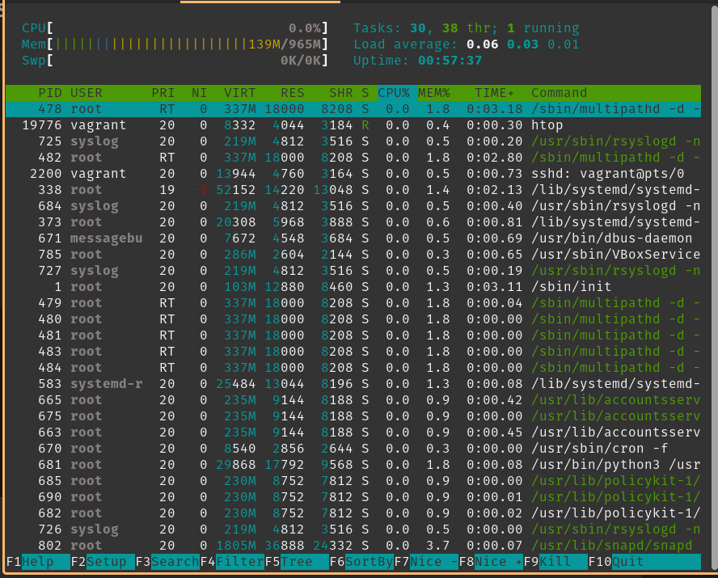
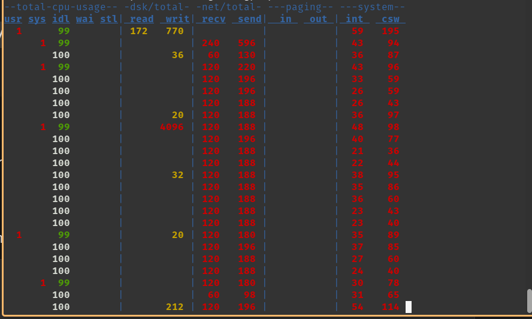
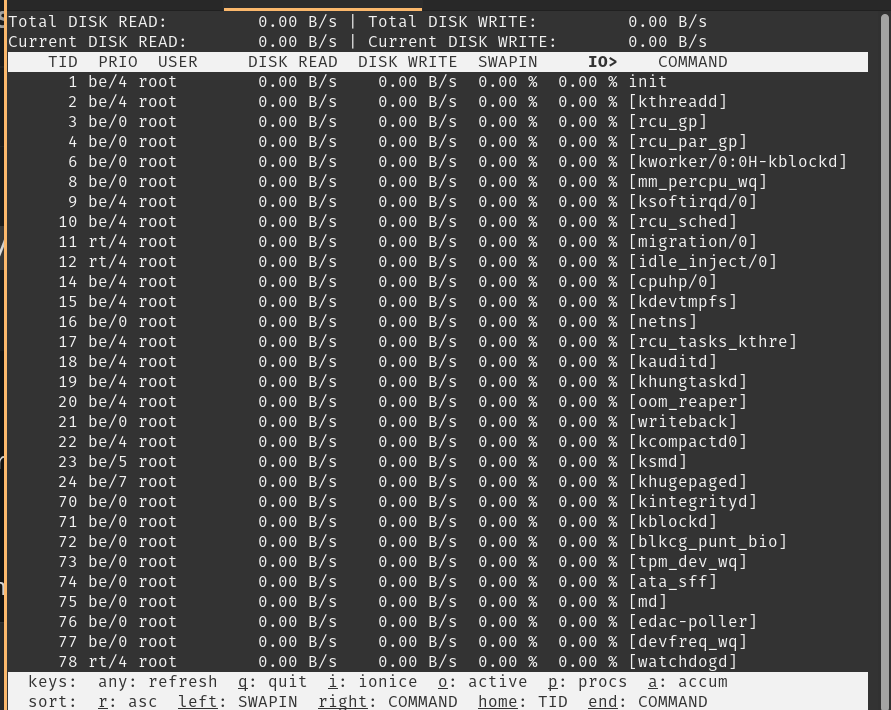
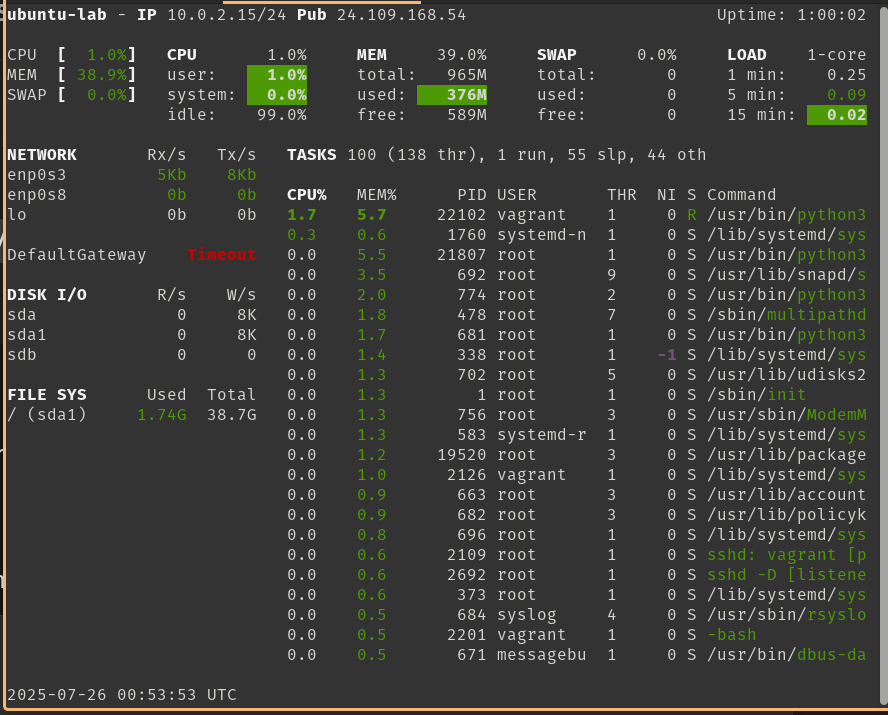

# Project 5 - Advanced System Monitoring

This project demonstrates advanced system monitoring using popular Linux tools.

## Tools Covered

- `htop`: Interactive process viewer
- `top`: Real-time system summary
- `glances`: Cross-platform monitoring tool
- `dstat`: Resource statistics over time

## Screenshots

### htop

### top

### glances

### dstat

